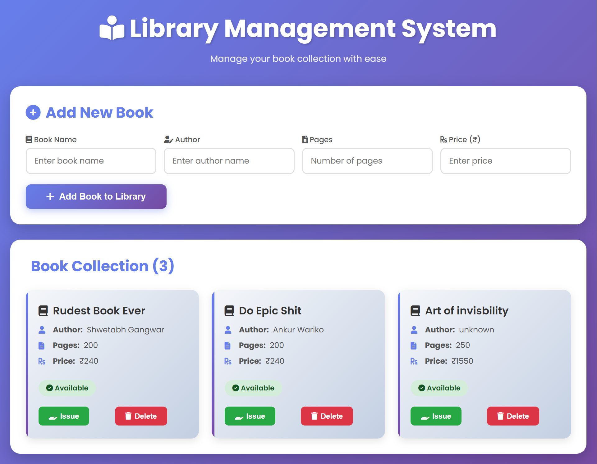

# 📚 Library Management System

A modern, full-featured Library Management System built with Node.js, Express, and EJS. Manage your book collection with an intuitive, beautiful UI featuring real-time operations for adding, issuing, returning, and deleting books.


## ✨ Features

- **📖 Book Management** - Add, view, update, and delete books from your library
- **🔄 Issue & Return** - Track book availability with issue and return functionality
- **🎨 Modern UI** - Beautiful gradient-based design with smooth animations
- **📱 Responsive Design** - Works seamlessly on desktop, tablet, and mobile devices
- **⚡ Real-time Updates** - Instant reflection of all book operations
- **🎯 Status Tracking** - Visual badges for book availability status
- **💫 Smooth Animations** - Elegant fade-in effects and hover transitions
- **🔍 Easy Navigation** - Card-based layout for better book browsing

## 🚀 Tech Stack

- **Backend:** Node.js, Express.js
- **Template Engine:** EJS (Embedded JavaScript)
- **Styling:** Custom CSS with modern design patterns
- **Icons:** Font Awesome 6
- **Fonts:** Google Fonts (Poppins)

## 📋 Prerequisites

Before running this project, make sure you have:

- [Node.js](https://nodejs.org/) (v14 or higher)
- [npm](https://www.npmjs.com/) (comes with Node.js)

## 🔧 Installation

1. **Clone the repository**

   ```bash
   git clone https://github.com/yourusername/library-management-system.git
   cd library-management-system
   ```

2. **Install dependencies**

   ```bash
   npm install
   ```

3. **Start the server**

   ```bash
   npm start
   ```

4. **Open in browser**
   ```
   http://localhost:3000
   ```

## 📖 Usage

### Adding a Book

1. Fill in the "Add New Book" form with:
   - Book Name
   - Author Name
   - Number of Pages
   - Price
2. Click "Add Book to Library"
3. The book will instantly appear in the collection

### Issuing a Book

- Click the **Issue** button on any available book
- The book status will change to "Issued"
- The Issue button will be replaced with a Return button

### Returning a Book

- Click the **Return** button on any issued book
- The book status will change back to "Available"
- The Return button will be replaced with an Issue button

### Deleting a Book

- Click the **Delete** button on any book
- The book will be permanently removed from the collection

## 📂 Project Structure

```
library-management-system/
├── views/
│   └── home.ejs          # Main template with modern UI
├── app.js                # Express server and routes
├── package.json          # Project dependencies and scripts
└── README.md             # Project documentation
```

## 🎯 API Routes

| Method | Route     | Description           |
| ------ | --------- | --------------------- |
| GET    | `/`       | Display all books     |
| POST   | `/`       | Add a new book        |
| POST   | `/issue`  | Issue a book          |
| POST   | `/return` | Return an issued book |
| POST   | `/delete` | Delete a book         |

## 🎨 UI Features

- **Gradient Background** - Eye-catching purple gradient
- **Card-Based Layout** - Each book displayed in its own card
- **Status Badges** - Color-coded availability indicators
  - 🟢 Green for Available
  - 🟡 Yellow for Issued
- **Hover Effects** - Interactive button and card animations
- **Responsive Grid** - Adapts to different screen sizes
- **Font Awesome Icons** - Visual indicators throughout the interface
- **Professional Typography** - Poppins font family

## 🔮 Future Enhancements

- [ ] User authentication and authorization
- [ ] Database integration (MongoDB/PostgreSQL)
- [ ] Search and filter functionality
- [ ] Book categories and genres
- [ ] Due date tracking for issued books
- [ ] Fine calculation for late returns
- [ ] PDF export of book inventory
- [ ] Student/member management
- [ ] Book reservation system
- [ ] Admin dashboard with analytics

## 🤝 Contributing

Contributions are welcome! Here's how you can help:

1. Fork the repository
2. Create a new branch (`git checkout -b feature/amazing-feature`)
3. Commit your changes (`git commit -m 'Add some amazing feature'`)
4. Push to the branch (`git push origin feature/amazing-feature`)
5. Open a Pull Request

## 📝 License

This project is open source and available under the [MIT License](LICENSE).

## 👨‍💻 Author

**Your Name**

- GitHub: [@yourusername](https://github.com/yourusername)
- LinkedIn: [Your Name](https://linkedin.com/in/yourprofile)

## 🙏 Acknowledgments

- Font Awesome for beautiful icons
- Google Fonts for Poppins typography
- Express.js community for excellent documentation
- All contributors who help improve this project

## 📸 Screenshots

### Application Preview


_Modern UI featuring card-based book display with gradient background, intuitive add book form, and interactive action buttons_

---

<div align="center">
  <p>Made with ❤️ and ☕</p>
  <p>If you found this project helpful, please give it a ⭐️</p>
</div>
